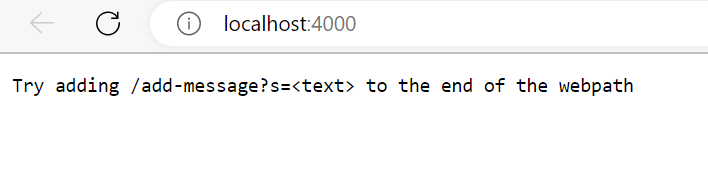
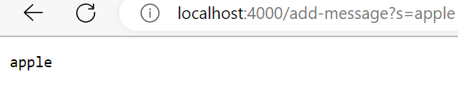
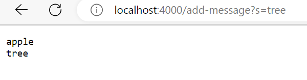

# CS15L Lab Report 2

To create a string server that takes in a string to add as text on the webpage. We create a similar script as that to NumberServer.java from the second lab.
We create a few conditional statements in the URLHandeler class on the StringServer.java file. The first conditional checks to make sure the path is `/add-message` which is what shows up at the end of the domain of a website path.  
<br />
Next we check to make sure the query is `?s` at which point we add the string the user writes at the end of 
the website path to a string which we return to be displayed on the website.
```
class Handler implements URLHandler {
    // The one bit of state on the server: a number that will be manipulated by
    // various requests.
    String str = "";

    public String handleRequest(URI url) {
        if (url.getPath().equals("/add-message")) {
            System.out.println("Path: " + url.getPath());
                String[] parameters = url.getQuery().split("=");
                if (parameters[0].equals("s")) {
                    str += parameters[1] + " \n";
                    return str;
                }
        }
        return "Try adding /add-message?s=<text> to the end of the webpath";
    }
}
```
<br />
Here is an example of using the website to add strings to the screen. 
<br />
<br />
<br />

<br />
We are greeted by this page before we add any queries or paths to the end of the website domain.
<br />
<br />
<br />

<br />
<br />
<br />
We add `/add-message?s=apple` to the end of the webpath and `apple` is displayed. The handleRequest method is run in the StringServer.java which takes in the url and finds that it is true that the path has `/add-message` as a path and that after splitting `s=apple` by the `=` the first of the two elements is "s". Therefore, the second element, or in this case "apple" is added to the string at which point it is returned and displayed on the website.
<br />

<br />
We change `/add-message?s=apple` to `/add-message?s=tree` the end of the webpath which again runs the handleRequest method. The same process occurs except now "tree" is added to a string which already contains "apple \n". Thus, the method returns
<br />
"apple"
<br />
"tree"
<br />
since we're concatenating the new query to the end of the string. The only value that is changing in each case is `str` which is a type `String` at the top of the class.

## Debugging in lab3
A fail inducing input for the LinkedList class is:
```
@Test
public void testAppend(){
    LinkedList testLink = new LinkedList();
    for (int i = 0; i < 4; i++) {
        testLink.append(i); // 0 -> 1 -> 2 -> 3
    }
    assertEquals( "0 2 3 ",  testLink.toString());
}
```
<br />
because the program in reality will look more like `3->2->1->0`. In fact before fixing the program, this test would cause a never ending loop because of a bug in prepend.
<br />
An input that would pass is 
```
@Test
public void testFilter(){
    String[] inpStr1 = {"apple", "banana", "tree", "peach", "code"};
    String[] result = {"apple", "banana", "peach"};
    List<String> input1 = Arrays.asList(inpStr1);
    assertEquals(ListExamples.filter(input1, new StringChecker() {
        public boolean checkString(String s){
        if(s.contains("a"))
            return true;
        return false; 
        }  
    }), Arrays.asList(result));
}
```
<br />
Below is the effect of running the first test:
<br />

<br />
<br />
Below is the effect of running the second test:
<br />


<br />
<br />
The bug in `append` was
```
while(n.next != null) {
    n = n.next;
    n.next = new Node(value, null);
}
```
at the bottom of the method because n.next is always set to a new node so when the while loop checks
it's condition, the n.next cannot be null. Thus we can take the `n.next = new Node(value, null);` out of the while loop and place it at the end of the method: 
```
while(n.next != null) {
        n = n.next;
    }
    n.next = new Node(value, null);
}
```
The fix here changes the issue because the loop will run until it reaches the last node before .next is null, and only then will it set the next node.

## What I've learned
I've learned how to create webservers locally and how to manipulate paths and queries to create different web pages. I've also learned how to more methodically test code for errors.
